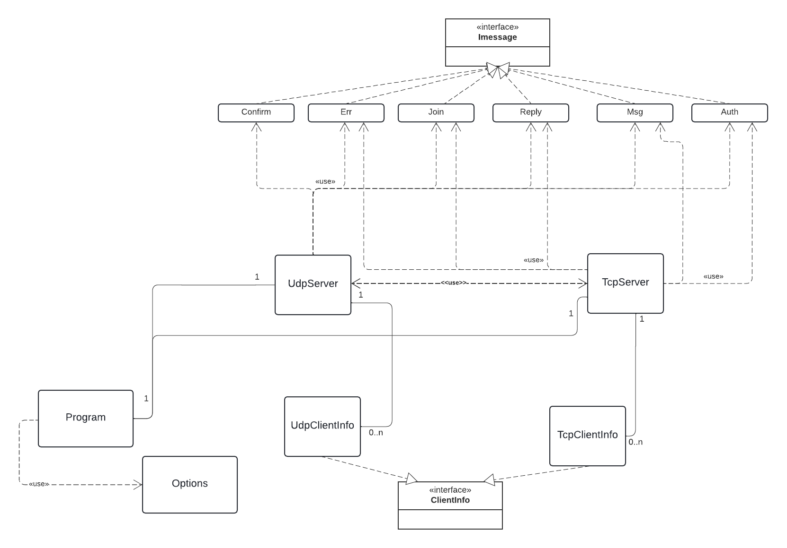

# IPK Project 1: Server for a chat server using IPK24-CHAT protocol
# Author: Alexandr Tihanschi xtihan00

### Structure
- Project entry
- Project functionality description
- Description of controversial/interesting points in the code
- Extensions
- Testing
- Bibliography

### Project entry
The project implements a server for client server application using such protocols as Udp, Tcp. The project was written in c# language where TcpClient, UdpClient were used for the basics with socket handling.
To operate the server on udp and tcp are used 2 classes TcpServer.cs and UdpServer.cs that implement the functionality of the application, to store information about each user are used classes TcpClientInfo.cs and UdpClientInfo.cs inherited from the same interface that allows you to use their data to communicate users on different protocols

### Project functionality description

The program starts with parsing arguments using the Options.cs class and then starts 2 processes, one for Udp and one for Tcp, and also uses a separate process waiting for the cancel token in case of program termination
Both classes are implemented in a similar way and when dealing with messages use classes from the previous project view [Project1] that have been improved in performance and reliability. In each class there is a process for accepting new incoming users after which an instance of ClientInfo is created and a method is called HandleClient() which receives a message from the user calls a certain method depending on the state of the user and also manages memory release after disconnecting the client depending on the state HandleAuthClient(), HandleOpenClient() methods are called which convert the incoming client message and act depending on it. To send a message to the user there is SendMessageAsync() method and SendMessageToChannel() method to send a message to the channel
UML diagram:


### Description of controversial/interesting points in the code

- If when working with a client we could easily terminate the program in case of an error, in the case of a server, if an exception is thrown when working with a client, the program will not terminate but will try to disconnect the user and free resources
- When releasing resources to terminate all processes with the user were fully utilized cancel tokens [@Manual]
- if an error occurs that will cause one of the processes for udp or tcp to stop, the program will try to correctly terminate the connection with users who are connected via another protocol before terminating its work.

### Extensions

The task did not specify how the program should behave if it is tried to terminate, so to correctly terminate the program all connected users will be sent a bye message, but in the channel the message that the user is disconnected will not be sent because it may delay the program termination too much, and then release the allocated resources and terminate the process

### Testing

Tests were conducted on Windows environment with connected student VPN for both server and client (When trying to work with a virtual machine it was impossible to assign the requested address)

UDP auth test:
```
RECV 100.64.103.212:61165 | AUTH
SENT 100.64.103.212:61165 | CONFIRM
SENT 100.64.103.212:61165 | REPLY
RECV 100.64.103.212:61165 | CONFIRM
RECV 100.64.103.212:65186 | BYE
SENT 100.64.103.212:65186 | CONFIRM
```

UDP join test:
```
RECV 100.64.103.212:61165 | AUTH
SENT 100.64.103.212:61165 | CONFIRM
SENT 100.64.103.212:61165 | REPLY
RECV 100.64.103.212:61165 | CONFIRM
RECV 100.64.103.212:62307 | JOIN
SENT 100.64.103.212:62307 | CONFIRM
SENT 100.64.103.212:62307 | REPLY
RECV 100.64.103.212:62307 | CONFIRM
RECV 100.64.103.212:65186 | BYE
SENT 100.64.103.212:65186 | CONFIRM
```

UDP msg test:
```
RECV 100.64.103.212:65179 | AUTH
SENT 100.64.103.212:65179 | CONFIRM
SENT 100.64.103.212:65179 | REPLY
RECV 100.64.103.212:65179 | CONFIRM
RECV 100.64.103.212:65179 | MSG
SENT 100.64.103.212:65179 | CONFIRM
RECV 100.64.103.212:65186 | BYE
SENT 100.64.103.212:65186 | CONFIRM
```

TCP auth test:
```
RECV 100.64.103.212:51076 | AUTH
SENT 100.64.103.212:51076 | REPLY
RECV 100.64.103.212:51076 | BYE
```

TCP join test:
```
RECV 100.64.103.212:51088 | AUTH
SENT 100.64.103.212:51088 | REPLY
RECV 100.64.103.212:51088 | JOIN
SENT 100.64.103.212:51088 | REPLY
RECV 100.64.103.212:51088 | BYE
```

TCP msg test:
```
RECV 100.64.103.212:51097 | AUTH
SENT 100.64.103.212:51097 | REPLY
RECV 100.64.103.212:51097 | MSG
RECV 100.64.103.212:51097 | BYE
```

Server exit test:
```
RECV 100.64.103.197:58704 | AUTH
SENT 100.64.103.197:58704 | REPLY
RECV 100.64.103.212:53723 | AUTH
SENT 100.64.103.212:53723 | CONFIRM
SENT 100.64.103.212:53723 | REPLY
SENT 100.64.103.197:58704 | MSG
RECV 100.64.103.212:53723 | CONFIRM
# PRESS CTRL C
SENT 100.64.103.197:58704 | BYE
SENT 100.64.103.212:53723 | BYE
RECV 100.64.103.212:53723 | CONFIRM

Process finished with exit code 0.
```

Server wrong data from user test:
- user input/output:
```
/auth f f f
Success: Success: You're logged in

/rename ffffffffffffffffffffffffffffffffffffffffffffffffffffffffffffffffffffffffffffff
msg
ERR FROM Server: unknown data
ERR: No confirm

Process finished with exit code 0.

```
- Server output:
```
RECV 147.229.208.84:57877 | AUTH
SENT 147.229.208.84:57877 | CONFIRM
SENT 147.229.208.84:57877 | REPLY
RECV 147.229.208.84:57877 | CONFIRM
RECV 147.229.208.84:57877 | MSG
SENT 147.229.208.84:57877 | CONFIRM
Wrong data from server      # stderr write
SENT 147.229.208.84:57877 | ERR
SENT 147.229.208.84:57877 | BYE
RECV 147.229.208.84:57877 | CONFIRM
RECV 147.229.208.84:57877 | BYE
SENT 147.229.208.84:57877 | CONFIRM

```
TCP and UDP dialog:

- TCP input/output:
```
/auth 1 1 Tcp
Success: Success: You're logged in
Server: Udp has join default
hi
Udp: hello
```

- UDP input/output:
```
/auth 2 2 Udp
Success: Success: You're logged in
Tcp: hi
hello
Server: Tcp has left default
```

- Server output:
```
RECV 100.64.103.197:58633 | AUTH
SENT 100.64.103.197:58633 | REPLY
RECV 100.64.103.212:54781 | AUTH
SENT 100.64.103.212:54781 | CONFIRM
SENT 100.64.103.212:54781 | REPLY
RECV 100.64.103.212:54781 | CONFIRM
RECV 100.64.103.212:54781 | BYE
SENT 100.64.103.212:54781 | CONFIRM
RECV 100.64.103.197:58633 | BYE
RECV 100.64.103.197:58652 | AUTH
SENT 100.64.103.197:58652 | REPLY
RECV 100.64.103.212:57506 | AUTH
SENT 100.64.103.212:57506 | CONFIRM
SENT 100.64.103.212:57506 | REPLY
SENT 100.64.103.197:58652 | MSG
RECV 100.64.103.212:57506 | CONFIRM
RECV 100.64.103.197:58652 | MSG
SENT 100.64.103.212:57506 | MSG
RECV 100.64.103.212:57506 | CONFIRM
RECV 100.64.103.212:57506 | MSG
SENT 100.64.103.212:57506 | CONFIRM
SENT 100.64.103.197:58652 | MSG
RECV 100.64.103.197:58652 | BYE
SENT 100.64.103.212:57506 | MSG
RECV 100.64.103.212:57506 | CONFIRM
RECV 100.64.103.212:57506 | BYE
SENT 100.64.103.212:57506 | CONFIRM
```

### Bibliography

[Project1] Tihanschi A. *Client for a chat server using IPK24-CHAT protocol* [online]. February 2024. [cited 2024-02-20]. Available at: https://git.fit.vutbr.cz/xtihan00/IPK_1

[@Manual]  Microsoft Corporation  *CancellationToken Struct*  [online]. 8 2021. [cited 2024-02-22]. Available at: https://learn.microsoft.com/en-us/dotnet/api/system.threading.cancellationtoken?view=net-8.0
